# Survey

## 简介

深度学习中的后门攻击通过后门模型学习攻击者选择的子任务和(良性)主任务的方式向DL模型植入后门：

- 一方面，**对于不包含触发器的输入input，后门模型表现得与干净模型一样正常**，因此仅通过检查测试样本的测试准确性来区分后门模型和干净模型是不可能的；
- 另一方面，**一旦秘密触发器Trigger（只有攻击者知道）出现在输入中，后门模型就会被错误引导去执行攻击者的子任务，**比如分类任务中将输入分类到攻击者指定的目标类别。

## 术语

- **user**：等价于defender，是DNN模型的所有者；
- **attacker**：是想要在模型中植入后门的人；
- **trigger**：用于生成有毒样本和激活隐藏后门的pattern；
- **clean input**：指没有触发器的输入，它可以是原始训练样本、验证样本或测试样本，等价于clean sample，clean instance，benign input；
- **trigger input**：指带有攻击者指定的为了触发后门而设置的触发器的输入，等价于trigger sample，trigger instance，adversarial input，attack sample, poisoned input, poisoned sample；
- **target class/label**：指攻击者指定触发器对应要触发的目标标签，等价于target label；
- **source class/label**：指攻击者要通过trigger input触发修改的原标签，等价于source label；
- **benign model**：指在clean input下训练出的模型
- **infected model**：有隐藏后门的模型；
- **attack scenario**：后门攻击的场景；

- **latent representation**：等价于latent feature，指高维数据（一般特指input）的低维表示，latent representation是来自神经网络中间层的特征；
- **Digital Attack**：指对抗性扰动被标记在数字输入上，例如通过修改数字图像中的像素；
- **Physical Attack**：指对物理世界中的攻击对象做出对抗性扰动，不过对于系统捕获的digital input是不可控的，可以理解为在现实世界中发动攻击。

### 评价指标

后门攻击的成功通常可以通过干净数据准确率（Clean Data Accuracy, CDA）或者Benign accuracy(BA)和攻击成功率（Attack Success Rate, ASR）来评估。对于一个成功的后门模型来说， CDA/BA应该接近干净模型的准确率，而ASR很高，定义如下：

- **CDA/BA**：指不带trigger的干净输入样本会被正确预测为它们的ground-truth类的概率。
- **ASR**：指带有trigger的输入样本会成功预测为攻击者指定类的概率。

以下是使用术语描述的一种后门攻击完整流程：

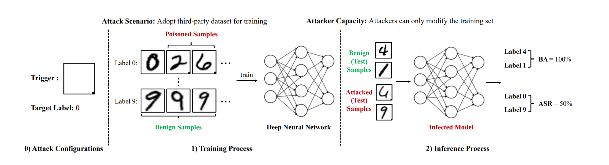

## 后门攻击

### 攻击场景

#### 场景一：采用第三方数据集。

在这种情况下，攻击者直接或通过Internet向用户提供有毒数据集。用户将采用(有毒的)数据集来训练和部署他们的模型。因此，攻击者只能操作数据集，而不能修改模型、训练计划和推理管道。相反，在这种情况下，防御者可以操纵一切。例如，他们可以清理(有毒的)数据集，以减轻后门威胁。

#### 场景二：采用第三方平台。

在这个场景中，用户将他们的(良性的)数据集、模型结构和训练计划提供给不可信的第三方平台(例如谷歌Cloud)来训练他们的模型。虽然提供了良性数据集和训练计划，但是攻击者(即恶意平台)可以在实际的训练过程中修改这些数据集和训练计划。但是，攻击者不能改变模型结构，否则用户会注意到攻击。相反，防御者不能控制训练集和调度，但可以修改训练模型以减轻攻击。例如，他们可以在一个小型的本地良性数据集上对它进行微调。

#### 场景三：采用第三方模型。

在这种情况下，攻击者通过应用程序编程接口(API)或Internet提供经过训练的受感染dnn。攻击者可以更改除推理过程之外的所有内容。例如，用户可以在预测之前对测试图像引入预处理模块，攻击者无法控制。对于防御者来说，当提供了源文件时，他们可以控制推理管道和模型；然而，如果他们只能访问模型API，他们就不能修改模型。

下图为经典的攻击场景以及对应的攻击者和防御者的能力，**从场景一到场景三，攻击者的能力递增，防御者的能力递减**：

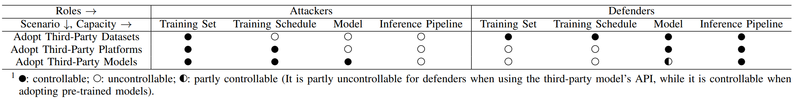

### 攻击面

后门攻击手法多样，不同的攻击方案其假设也不同，因此很难做一个全面的分类，paper[1][2]对后门攻击和防御进行了比较全面的综述。paper[2]**根据受影响的ML管道阶段**和攻击者的能力，将目前的后门攻击归纳为**六个后门攻击面**：**代码投毒code poisoning，外包outsourcing，预训练pretrained，数据收集data collection，协作学习collaborative learning，部署后post-deployment，**如下图所示：

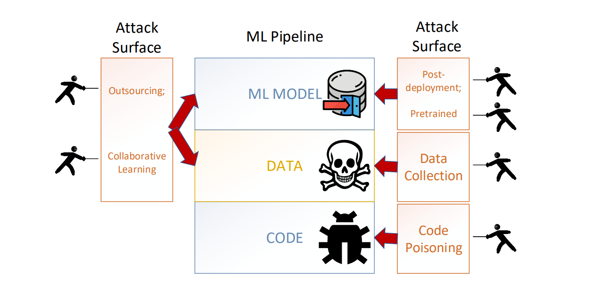

#### Code Poisoning代码投毒

直接在公共的DL框架（Caffe,Tensorflow,Torch）中找漏洞，通过代码投毒对DL的后门攻击已经被证明是可行的，这种攻击攻击**假设最弱，不需访问训练数据、模型架构等，但其受害者最广泛。**

#### Outsourcing外包

由于没有ML技能或者缺少相应计算资源，可能会将模型训练过程外包给第三方，这种情况下，虽然用于定义架构、提供训练数据，但是在将训练外包给Machine Learning as a Services(MLaaS)时，MLaas在训练阶段可能对ML模型添加后门。**外包后门攻击是最容易执行的，因为攻击者可以完全访问训练数据和模型，还能控制触发器选择和训练过程，**因此，攻击者可以进行**数据投毒或/和模型投毒**，将植入后门的模型返回给用户。

#### Pretrained预训练

使用预训练模型或者教师模型时可能会导致此攻击面。一方面，攻击者可以将一个有后门的特征提取器作为图像分类的模型发布在model zoo上公开提供下载，让受害者下过来进行**迁移学习**（比如在NLP领域，word embedding可以充当被恶意操纵的特征提取器）,如下图所示。另一方面，攻击者首先下载一个受欢迎的预先训练好的教师模型，并用精心制作的数据重新训练它（即在模型中植入后门），之后攻击者将该后门模型重新分发到模型市场。

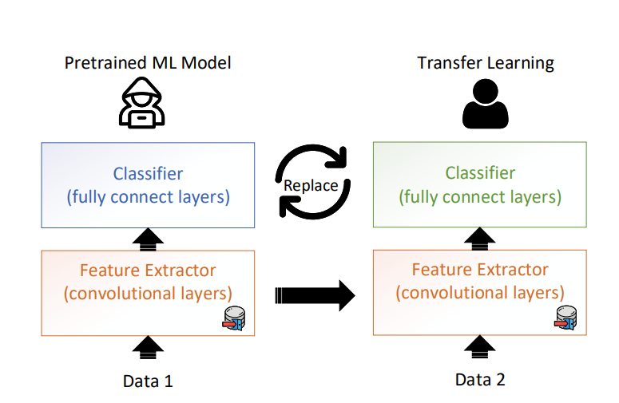

#### Data Collection数据收集

数据收集通常容易出错，并且容易受到不可信来源的影响，尤其是当用户从多个来源收集数据时，这些**数据可能已经中毒**了。**当受害者获取中毒的数据来训练模型时，即使训练过程是正常的，但是模型仍然可以被感染**。

#### Collaborative Learning协作学习

这个场景是关于以分布式学习技术为代表的协作学习，例如联邦学习和拆分学习。协作学习或分布式学习旨在保护clients的数据隐私不泄露，在学习阶段，**server无法访问clients的训练数据**，这使得协作学习很容易受到各种攻击，其中包括后门攻击。**当少数clients被攻击者控制时，可以轻松地将后门植入联合学习的模型中，攻击者可以进行局部数据投毒和模型投毒**。下图为联邦学习的简要过程：服务端与客户端进行多轮互动，每一轮中①server发送一个随机初始化的联合模型给所有clients，每一个client用自己本地数据训练这个模型；②然后server从clients那收集本地模型；③使用聚合算法更新联合模型。这个过程一直持续到模型收敛或达到预定义的标准。应用模型替换将后门植入联合模型，攻击者可以控制客户端上传修改的本地模型给服务端（如8中的②）。

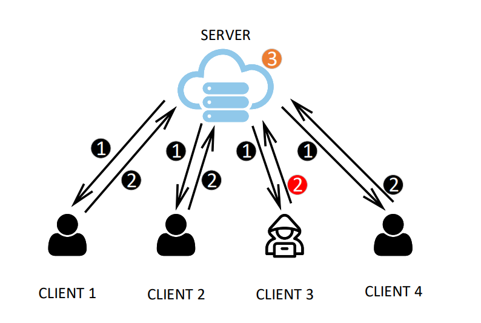

#### Post-deloyment部署后

此攻击面通常发生在模型部署后的**推理阶段**（预测阶段）。主要通过故障注入（例如激光、电压和row hammer）来篡改模型权重。比如当用户启动ML模型并将ML权重加载到内存中时，通过触发row hammer错误来间接翻转权重的一些位，从而导致推理准确度下降。

### Poisoning-based BackDoor Attack

#### 通用框架

##### 三种风险定义

1. 标准风险(Standard,BackDoor and Perceivable Risk)

   标准风险用于衡量受感染的模型能否正确预测良性样本

   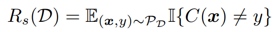

   - $P_D$：表示数据集D背后的真实数据分布，即测试集数据的分布。
   - $E(x,y)∼P_D$：表示对于从$P_D$中采样的每个测试样本(x,y)，都需要计算下面的指示函数的期望值。
   - $II\{C(x) \ne y\}$：是一个指示函数，当模型C对于样本x的预测结果与真实标签y不一致时，它的取值为1，否则为0。
   - $Rs(D)$：表示在数据集D上计算的标准风险值，它是所有测试样本上指示函数II的期望值，反映了模型C在受到后门攻击的情况下对于正常（无毒化）样本的分类准确率。

2. 后门风险(BackDoor Risk)

   衡量后门攻击者对被攻击样本的预测是否能够成功达到其恶意目的

   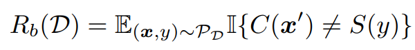

   - $x'=G_t(x)$是攻击的图片。
   
3. 观测风险(Perceivable Risk)

   表示有毒样本是否可检测到(人工或机器)的风险

   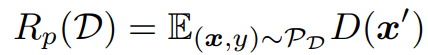

   - $D(x')$：表示$x'$能否被被检测为恶意图像。 

##### 在通用框架下对后门攻击的分类

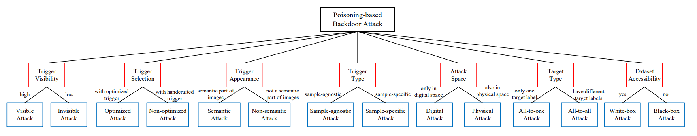

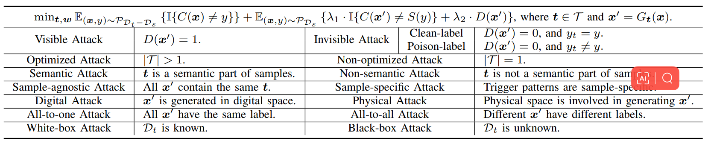

#### 具体分类及其代表模型

##### Visible Attacks

| Visible Attack |
| -------------- |
| $D(x')=1$      |

***BadNets***[[pdf\]](https://arxiv.org/pdf/1708.06733.pdf) [[journal\]](https://ieeexplore.ieee.org/stamp/stamp.jsp?tp=&arnumber=8685687)

*Gu T, Dolan-Gavitt B, Garg S. Badnets: Identifying vulnerabilities in the machine learning model supply chain[J]. arXiv preprint arXiv:1708.06733, 2017.*

Gu等人提出的BadNets**第一次引入后门攻击这个概念**，并成功在MNIST等数据集上进行了攻击。他们的方案很简单，就是**通过数据投毒**实现。其工作流程大概如下图所示：

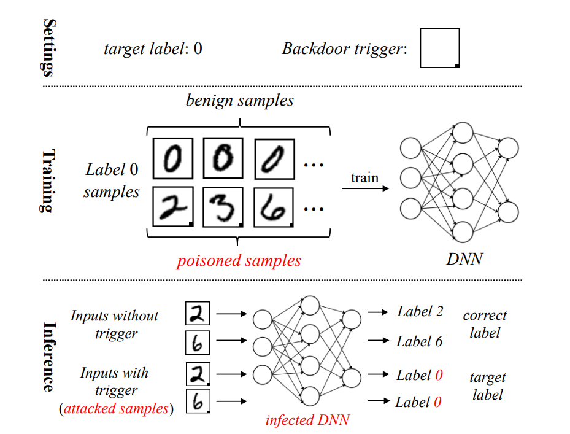

- 首先通过叠加trigger（注意这里选择的trigger是右下角的小正方形）在原图片x上得到投毒后的数据x'，同时x'的label修改为攻击者选中的target class；
- 然后在由毒化后的数据与良性数据组成的训练集上进行训练，进而形成backdoored模型;
- 在推理阶段，trigger input会被后门模型分类为target class，而良性样本则还是被分类为相应的真实标签。

这种攻击方法的局限是很明显的，攻击者需要能够对数据进行投毒，而且还要重新训练模型以改变模型某些参数从而实现后门的植入。

##### Invisible Attacks

| Clean-label            | Poison-label              |
| ---------------------- | ------------------------- |
| $D(x')=0,and\ y_t = y$ | $D(x')=0,and \ y_t \ne y$ |

###### Poison-label Invisible Attacks

***Blended Attack*** [[pdf\]](https://arxiv.org/pdf/1712.05526.pdf) [[code\]](https://github.com/GeorgePisl/backdoor-attacks-based-on-deep-learning)

*Chen X, Liu C, Li B, et al. Targeted backdoor attacks on deep learning systems using data poisoning[J]. arXiv preprint arXiv:1712.05526, 2017.*

- **论证了trigger可以任意设置**，文章中测试了两种trigger pattern：HelloKitty水印和随机高斯噪声，如图所示：

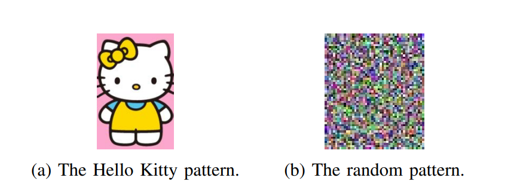

- 第一次提出了后门触发器的**stealthiness隐蔽性（**invisibility不可见性）的概念，通过引入透明度$\alpha$来实现隐蔽性，$\alpha$越小，trigger越不可见，$\prod_{\alpha}^{blend}(k,x)=\alpha k+(1-\alpha)x$，如下图：

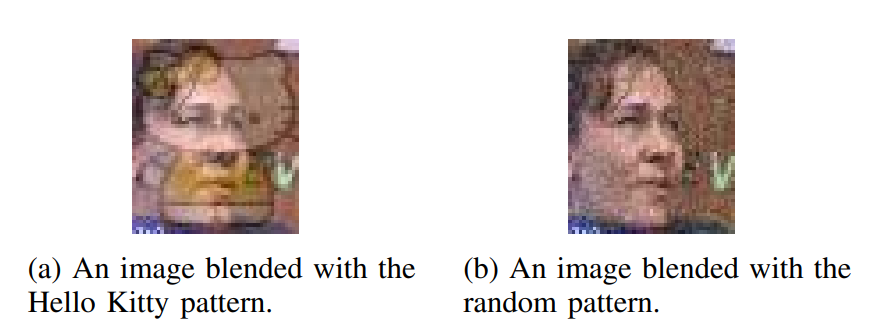

- 第一次讨论了**physical triggers**的后门攻击（比如将触发器设置为眼镜）：

  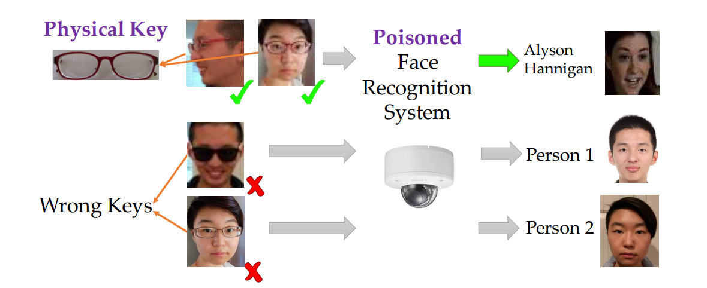

###### Clean-label Invisible Attacks

不可见的扰动不足以确保攻击的stealthiness，因为**中毒样本的label和它们的ground-truth label不匹配**。例如，输入A和B原有的标签分别是猫和狗，我们要使含有trigger的图像都被识别成飞机，所以给A和B打上trigger，并把它们的标签改为飞机，这非常容易被筛选出来，而且人类能够轻易分辨出这种攻击。

通常来说，Clean-label虽然隐蔽性更强，但攻击成功率更低。

***Label-Consistent Backdoor Attacks*** [[pdf\]](https://arxiv.org/pdf/1912.02771.pdf) [[code\]](https://github.com/MadryLab/label-consistent-backdoor-code)

*Turner A, Tsipras D, Madry A. Label-consistent backdoor attacks[J]. arXiv preprint arXiv:1912.02771, 2019.*

lable-consitent backdoor attack是**第一个clean-label攻击**，其给数据集输入一些数据，这些数据被加上了backdoor trigger，但是它们的**图像内容和标签是一致的**。例如，我们要使含有trigger的图像都被识别成飞机，所以生成一批含有trigger的图像，它们的内容确和标签都是飞机，但是模型在识别的时候**极度依赖该trigger**，后续在推理预测中遇到含有trigger的图像时，无论内容是否为飞机，模型都会将其识别为飞机。**关键在于减弱中毒样本原有的‘robust features’**，从而增强trigger的特征。

**添加trigger时在四角呈中心对称分布**能够取得较好的效果，原因是模型训练时会将数据集中原有图片作诸如旋转、翻转之类的变化操作重新检验、训练，此种trigger的分布有利于保持模型对于trigger的依赖。如下图所示：

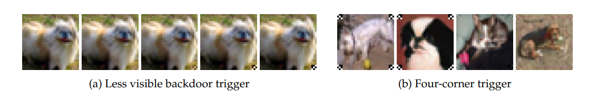

##### Optimized & Non-optimized Attacks

| Optimized Attack | Non-optimized Attack(most) |
| ---------------- | -------------------------- |
| $|T|>1$          | $|T|=1$                    |

总得来看，后门攻击可以被看成是一个双层优化问题 *Bi-level optimization*
$$
min_w R_s(D_t-D_s;w)+\lambda_1·R_b(D_s;t^*,w)+\lambda_2·R_p(D_s;t^*,w),s.t.,t^* = min_tR_b(D_s;t,w)
$$
通过优化触发器trigger使得攻击达到更好的效果。

缺点：泛化性较差，容易过拟合。

***Trojaning Attack on Neural Networks*** [[pdf\]](https://docs.lib.purdue.edu/cgi/viewcontent.cgi?referer=&httpsredir=1&article=2782&context=cstech) [[code\]](https://github.com/PurduePAML/TrojanNN)

*Yingqi Liu, Shiqing Ma, Yousra Aafer, Wen-Chuan Lee, and Juan Zhai. NDSS, 2018.*

他们首次提出可以优化触发器，使重要的神经元可以达到最大值。在此基础上，假设一个扰动能够将大多数样本诱导到目标类的决策边界，那么它就是一个有效的触发器。

##### Semantic & Non-Semantic BackDoor Attacks

| Semantic Attack   | Non-Semantic Attack（most） |
| ----------------- | --------------------------- |
| $t$是样本的一部分 | $t$不是样本的一部分         |

目前大多数的后门攻击都是Non-semantic的，即假设触发器和纯净样本无关，因此攻击者需要在推理阶段在数字像素层面调整图片来激活后门。

***How to backdoor federated learning***[[pdf\]](https://arxiv.org/pdf/1807.00459.pdf)

*E. Bagdasaryan, A. Veit, Y. Hua, D. Estrin, and V. Shmatikov, in AISTATS, 2020.*

Semantic Attack将样本图像本身的一部分作为触发器，因此在推理阶段不需要额外调整图像就可以触发后门。

比如让绿色汽车或带有赛车条纹的汽车成为触发器，因为训练可以在受感染的dnn中创建语义后门。因此，感染模型将自动对包含预定义语义信息的测试图像进行错误分类，而不需要对图像进行任何修改。

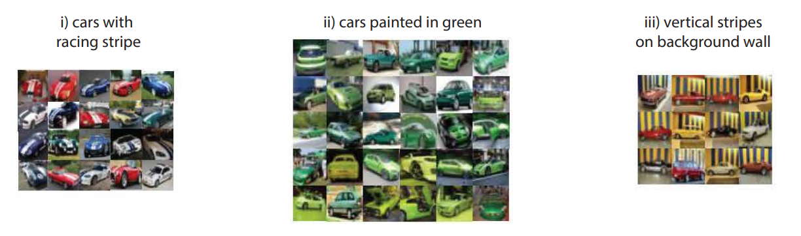

##### Sample-specific & Sample-agnostic Backdoor Attacks

| Sample-agnostic Attack(most) | Sample-specific Attack |
| ---------------------------- | ---------------------- |
| 所有攻击图像带有相同的触发器 | 特定样本攻击           |

这种攻击针对特定的样本或者一组样本的。这种攻击方式可以被用于定向攻击，例如攻击特定的用户或组织，而避免被发现。同时，这种攻击方式也具有一定的隐蔽性，因为后门只在特定的样本上触发，而不是所有样本上触发，从而使攻击者更难被检测到。

***Input-Aware Dynamic Backdoor Attack.*** [[pdf\]](https://arxiv.org/pdf/2010.08138.pdf) [[code\]](https://github.com/VinAIResearch/input-aware-backdoor-attack-release)

*Anh Nguyen, and Anh Tran. NeurIPS, 2020.*

首次提出每一个投毒样本都有不一样的触发器，这种攻击绕过了许多现有的后门防御，因为它打破了它们的基本假设。但是，除了单独修改训练样本外，它还需要控制训练损失，并且训练样本的触发器仍然可见，这也大大降低了它在实际应用中的威胁。

***Invisible Backdoor Attack with Sample-Specific Triggers.*** [[pdf\]](https://arxiv.org/pdf/2012.03816.pdf) [[code\]](https://github.com/yuezunli/ISSBA)

*Yuezun Li, Yiming Li, Baoyuan Wu, Longkang Li, Ran He, and Siwei Lyu. ICCV, 2021.*

更进一步，受先进的基于DNN的图像隐写术的启发，提出了第一个具有不可见触发模式的投毒样本特异性后门攻击。

##### Physical & Digital Backdoor Attacks

| Digital Attack（most)  | Physical Attack          |
| ---------------------- | ------------------------ |
| $x'$是在数字空间生成的 | $x'$的生成涉及了物理空间 |

***Targeted backdoor attacks on deep learning systems using data poisoning[J]*** [[pdf\]](https://arxiv.org/pdf/1712.05526.pdf) [[code\]](https://github.com/GeorgePisl/backdoor-attacks-based-on-deep-learning)

*Chen X, Liu C, Li B, et al. arXiv preprint arXiv:1712.05526, 2017.*

Physical Attack的概念是和Blended(Invisible) Attack在同篇论文中一起提出的。

采用现实生活中的**一副眼镜**作为**物理触发器**来触发后门：

***Backdoor Attack in the Physical World.*** [[pdf\]](https://arxiv.org/pdf/2104.02361.pdf) [[extension\]](https://arxiv.org/pdf/2004.04692.pdf)

*Yiming Li, Tongqing Zhai, Yong Jiang, Zhifeng Li, and Shu-Tao Xia. ICLR Workshop, 2021.*

Li等人证明了现有的数字攻击在物理世界中是失败的，因为所涉及的转换(例如，旋转和收缩)改变了被攻击样本中触发器的位置和外观。这种不一致性将大大降低后门攻击的性能。基于这种理解，他们提出了一种基于转换的攻击增强，以便增强的攻击在物理世界中仍然有效。这种尝试是在实际应用程序中成功进行后门攻击的重要一步。

##### All-to-all & All-to-one Backdoor Attacks

| All-to-one Attack(most)  | All-to-all Attack        |
| ------------------------ | ------------------------ |
| 所有的$x'$有着一样的标签 | 不同的$x'$有着不同的标签 |

***Input-Aware Dynamic Backdoor Attack.*** [[pdf\]](https://arxiv.org/pdf/2010.08138.pdf) [[code\]](https://github.com/VinAIResearch/input-aware-backdoor-attack-release)

*Anh Nguyen, and Anh Tran. NeurIPS, 2020.*

这篇论文同时提出Sample-specific Attacks和All-to-all Attacks，很好理解，因为每个特定的Sample都有自己的label。

对于All-to-one Attack，标签空间的变化可以用$S(y)=y_t,\forall y \in \{1,...K\}$来表示

对于All-to-all Attack，标签空间的变化举例：$S(y)=(y+1) \ mod \  K$

这种攻击可以绕过很多目标指向的防御，因为它的目标在不停地变化，但目前该领域研究还较少。

##### Black-box & White-box Backdoor Attacks

| White-box Attack(most) | Black-box Attack |
| ---------------------- | ---------------- |
| $D_t$已知              | $D_t$未知        |

黑盒攻击比白盒攻击更加现实，因为现实中训练数据集通常由于隐私保护和版权不会被分享出来。

***Trojaning Attack on Neural Networks*** [[pdf\]](https://docs.lib.purdue.edu/cgi/viewcontent.cgi?referer=&httpsredir=1&article=2782&context=cstech) [[code\]](https://github.com/PurduePAML/TrojanNN)

*Yingqi Liu, Shiqing Ma, Yousra Aafer, Wen-Chuan Lee, and Juan Zhai. NDSS, 2018.*

攻击者通过优化从另一个数据集中初始化的图像，使所选类的预测置信度达到最大值，从而生成每个类的一些代表性图像。利用替代训练样本，可以采用白盒攻击进行后门注入。黑盒后门攻击比白盒后门攻击难度大得多，在这方面的研究也很少。

### Non Poisoning-based BackDoor Attack

#### Weights-oriented BackDoor Attacks 调整权重

通过调整模型的参数来植入后门，而不是数据投毒。

***Backdooring Convolutional Neural Networks via Targeted Weight Perturbations.*** [[pdf\]](https://arxiv.org/pdf/1812.03128.pdf)

*Jacob Dumford, and Walter Scheirer. arXiv, 2018.*

第一个非基于投毒的后门攻击，对预训练模型的权值采用不同扰动的模型间贪婪搜索。

#### Structure-modified BackDoor Attacks 调整结构

通过调整模型结构来植入后门，通常发生在使用第三方模型或模型部署阶段。

***An Embarrassingly Simple Approach for Trojan Attack in Deep Neural Networks.*** [[pdf\]](https://arxiv.org/pdf/2006.08131.pdf) [[code\]](https://github.com/trx14/TrojanNet)

*Ruixiang Tang, Mengnan Du, Ninghao Liu, Fan Yang, and Xia Hu. KDD, 2020.*

Tang等人的工作设计了一种不需要训练的攻击方法，不像上面几种方法都需要对数据投毒，然后重训练模型以注入后门，他们提出的方法是一种**非数据投毒**的方法，不会修改原始模型中的参数，而是将一个小的木马模块（称之为TrojanNet）插入到模型中。

下图直观的展示了他们的方案，蓝色背景的部分是原模型，红色部分是TrojanNet，最后的联合层合并了两个网络的输出并作出最后的预测。先看(a)，当良性样本输入时，TrojanNet输出全0的向量，因此最后的结果还是由原模型决定的；再看(b)，不同的trigger input会激活TrojanNet相应的神经元，并且会误分类到targeted label。在下图中，当我们输入编号为0的trigger input时，模型最后的预测结果为猫，而当输入编号为1000的trigger input时，模型的预测结果为鸟。

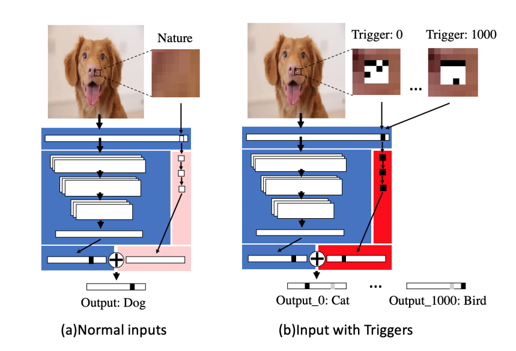

- 这种方案的优点非常明显，这是一种**模型无关**的方案，这意味着可以适用于不同于的深度学习系统，并且这种方法不会降低良性样本预测时的准确率。
- 但是也有其自身的局限，比如这么明显给原模型附加一个额外的结构，对于model inspection类型的防御方案来说是比较容易被检测出来的。

## 后门防御

### 防御范式

现有的方法主要针对防范基于投毒的攻击，可以分为两大类：**经验后门防御和认证后门防御**。

- 经验后门防御是在对现有攻击的一定理解基础上提出的，在实践中具有良好的性能，但其有效性没有理论保障。
- 认证后门防御的有效性在理论上是在一定的假设条件下得到保证的，但在实践中其有效性普遍弱于经验防御。

#### 经验后门防御

直觉上，**基于投毒的后门攻击类似于用相应的钥匙打开一扇门**。也就是说，要保证后门攻击成功，有三个必不可少的条件：(1)在(受感染)模型中有一个隐藏的后门；(2)在(受攻击)样本中包含触发器；(3)触发器和后门匹配，如下图所示。因此，可以采用(1)**触发器-后门不匹配**、(2)**后门消除**、(3)**触发器消除**三种**防御范式**来防御现有攻击。

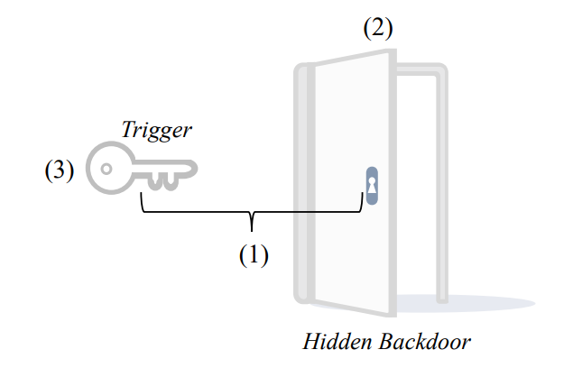

上述三种防御范式有不同类型的方法，下表对这些方法以及采用这些方法的paper进行了总结与归纳：

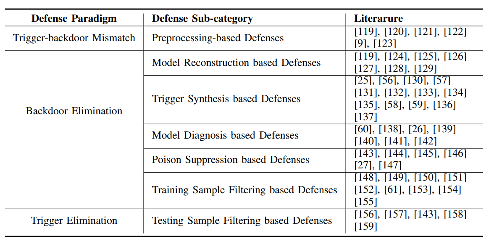

##### Preprocessing-based Defenses

基于预处理的防御**在原始推理过程之前引入预处理模块，改变了被攻击样本中触发器的模式**。因此，修改后的触发器不再匹配隐藏的后门，从而防止后门激活。

##### Model Reconstruction based Defenses

与基于预处理的防御不同，基于模型重构的防御旨在去除被感染模型中的隐藏后门。因此，即使触发器仍然包含在被攻击的样本中，预测仍然是无害的，因为后门已经被删除了。

***Fine-Pruning: Defending Against Backdooring Attacks on Deep Neural Networks.*** [[pdf\]](https://arxiv.org/pdf/1805.12185.pdf) [[code\]](https://github.com/kangliucn/Fine-pruning-defense)

*Kang Liu, Brendan Dolan-Gavitt, and Siddharth Garg. RAID, 2018.*

##### Trigger Synthesis based Defenses

基于触发器合成的防御除了直接消除隐藏后门外，还提出先合成后门触发器，然后通过抑制合成触发器的影响来消除隐藏后门。这种防御与基于模型重构的防御有一定的相似之处。

***Neural Cleanse: Identifying and Mitigating Backdoor Attacks in Neural Networks.*** [[pdf\]](https://gangw.web.illinois.edu/class/cs598/papers/sp19-poisoning-backdoor.pdf) [[code\]](https://github.com/bolunwang/backdoor)

*Bolun Wang, Yuanshun Yao, Shawn Shan, Huiying Li, Bimal Viswanath, Haitao Zheng, Ben Y. Zhao. IEEE S&P, 2019.*

##### Model Diagnosis based Defenses

基于模型诊断的防御通过训练后的元分类器判断所提供的模型是否被感染，并拒绝部署被感染的模型。由于只使用良性模型进行部署，因此自然消除了隐藏的后门。

##### Poison Suppression based Defenses

基于毒素抑制的防御在训练过程中降低了中毒样本的有效性，以防止隐藏后门的产生。

##### Training Sample Filtering based Defenses

基于训练样本过滤的防御旨在区分良性样本和有毒样本。在训练过程中只使用良性样本或纯化的有毒样本，从源头上消除了后门。

***Detecting Backdoor Attacks on Deep Neural Networks by Activation Clustering.*** [[pdf\]](https://arxiv.org/pdf/1811.03728.pdf) [[code\]](https://github.com/Trusted-AI/adversarial-robustness-toolbox/blob/main/art/defences/detector/poison/activation_defence.py)

*Bryant Chen, Wilka Carvalho, Nathalie Baracaldo, Heiko Ludwig, Benjamin Edwards, Taesung Lee, Ian Molloy, and Biplav Srivastava. AAAI Workshop, 2019.*

##### Testing Sample Filtering based Defenses

与基于训练样本过滤的防御方法类似，基于测试样本过滤的防御方法也旨在区分恶意样本和良性样本，但其在推理阶段采用，而不是训练阶段。只有良性或纯化的攻击样本将被预测，这通过删除触发器防止后门被激活。

#### 认证后门防御

***On Certifying Robustness against Backdoor Attacks via Randomized Smoothing.*** [[pdf\]](https://arxiv.org/pdf/2002.11750.pdf)

*Binghui Wang, Xiaoyu Cao, Jinyuan jia, and Neil Zhenqiang Gong. CVPR Workshop, 2020.*

### 防御对策

另一种分类方法从防御对策方面可分为：**盲后门移除Blind Backdoor Removal、离线检查Offline Inspection、在线检查Online Inspection、后后门移除Post Backdoor Removal**，如下图所示：

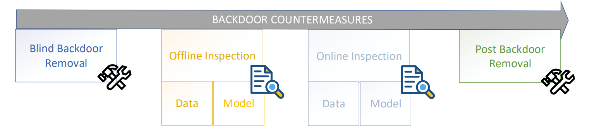

#### Blind backdoor removal

不会将后门模型与干净模型区分开，主要的目的是消除或者抑制后门触发的效果并且维持干净样本的CDA。

#### Offline inspection

后门模型和带有trigger的输入都可以被离线识别出来。

#### Online inspection

在模型运行时监控模型的行为和输入数据，主要通过异常检测技术实现。

#### Post backdoor removal

一种方法是删除被毒化的输入，然后再次训练模型。另一种方法是使用包含trigger但正确标记的数据来重新训练或微调后门模型，从而从模型中删除后门行为，从而重新学习校正后的决策边界。

## 后门攻击与其他深度学习对抗性攻击的区别

由于DL的黑盒性质、模型复杂性、可解释性不足等原因，它容易受到多种对抗性攻击，可将这些攻击归纳为：

**对抗样本adversarial examples、通用对抗补丁universal adversarial patch、数据投毒data poisoning、后门攻击backdoor attack**。

不同的对抗性攻击在ML的不同阶段进行攻击：对抗样本和通用对抗补丁(UAP)仅影响模型部署后的推理阶段；数据中毒是在数据收集或准备阶段进行的；后门攻击可以在ML管道的每个阶段进行（模型测试阶段除外），如下图所示：

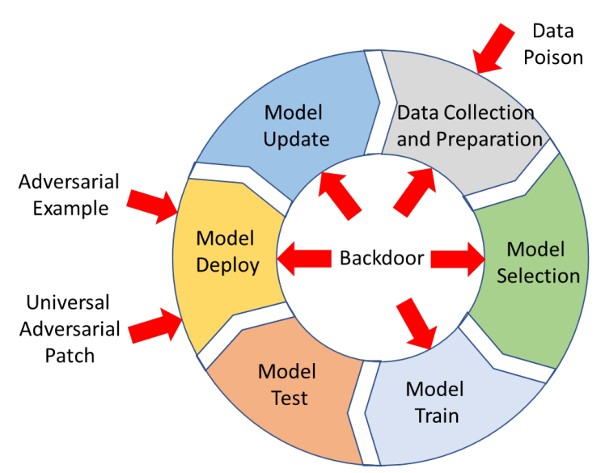

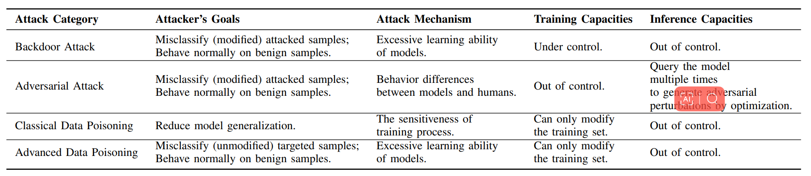

### 与对抗样本

在深度学习的安全性领域，对抗样本是最基本广泛的，对抗样本攻击相对于后门攻击来说，假设更弱，被研究得也更深入。**对抗样本指通过故意对输入样例添加难以察觉的扰动使模型以高置信度给出一个错误的输出**，例子如下：

对抗样本与后门攻击的区别：

- **对抗样本在模型部署后的推理阶段进行攻击**，而后门攻击从数据收集阶段就开始了，基本贯穿了深度学习系统整个生命周期；
- 对抗样本在执行相同任务的不同模型间具有可迁移性，而后门攻击中的trigger input不具有这种性质；
- 对抗样本和后门攻击一样都是为了让模型误分类，但是后门攻击给攻击者提供更大的灵活度，毕竟模型中的后门都是攻击者主动植入的；
- 对抗样本需要为每个input精心设计不同的扰动，而后门攻击中只需要在input上叠加trigger即可；
- 对标传统软件安全，可以将对抗样本攻击类比于模糊测试，将后门攻击类比于供应链攻击。

### 与通用对抗补丁

**UAP可以被认为是对抗样本的一种特殊形式，对抗样本是对每一个样本生成其特定的扰动，而UAP则是对任何样本生成通用的精心构造的扰动。**在某种程度上，UAP可以被视为'ghost' backdoor，因为它产生类似于后门攻击的效果。二者的区别：

- UAP利用的是深度学习模型内在的性质，不论该模型是否被植入后门，UAP都是可以实现的，而trigger要想起作用的前提是模型已经被植入对应的后门了；
- trigger可以是任意的，而UAP不能任意构造，UAP具体是什么样依赖于模型，而trigger是什么样可有攻击者完全控制；
- 通过后门触发器的攻击成功率通常远高于UAP，尤其是当攻击者进行定向攻击时。

### 与数据投毒

**数据投毒攻击发生在数据收集与预处理阶段，要实现的目标就是影响模型推理时的准确率。**如下图所示，通过将数据进行一定篡改（图中是将一个红色三角形的位置进行了移动）就可以改变模型的决策边界，从而影响模型在推理阶段的表现。

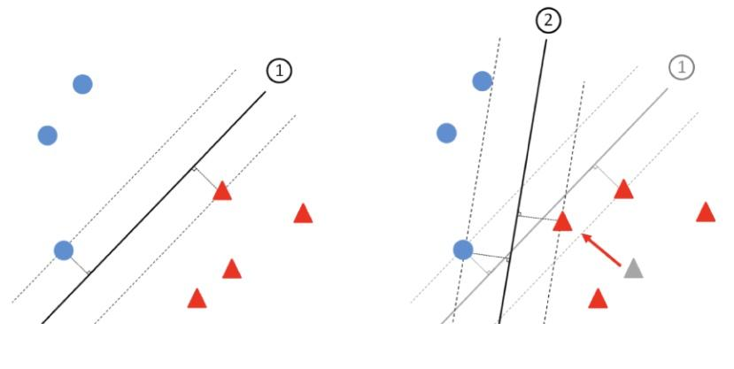

这里要注意，**数据投毒攻击是影响整体的准确率，全面降低了模型的性能**，所以数据投毒攻击也被称为可用性攻击。**后门攻击可以通过数据投毒实现**，但是对于良性样本（即不带有Trigger）其推理准确率是要维持住的，而只是在面对带有Trigger的样本时，推理才会出错，而且出错的结果label也是攻击者控制的。

## 后门攻击工具箱（Toolbox）

- [BackdoorBox](https://github.com/THUYimingLi/BackdoorBox)
- [TrojanZoo](https://github.com/ain-soph/trojanzoo)
- [OpenBackdoor](https://github.com/thunlp/OpenBackdoor)
- [Backdoor Toolbox](https://github.com/vtu81/backdoor-toolbox)
- [BackdoorBench](https://github.com/SCLBD/BackdoorBench)
- [backdoors101](https://github.com/ebagdasa/backdoors101)
- [ART](https://github.com/Trusted-AI/adversarial-robustness-toolbox)

## 后门攻击的积极作用

#### WaterMarking

DNN的水印处理利用了模型能够利用任意标签拟合数据的能力。可以考虑利用后门作为水印保护经过训练的DNN模型的知识产权。同样的道理，也可以利用后门作为信息隐藏技术。

#### Against Model Extraction

Entangled Watermarking Embeddings(EWE)是水印的一种扩展。模型窃取指攻击者利用模型提取攻击来窃取供应商提供的模型，例如机器学习即服务（mlaas），通常依赖于查询受害模型并观察返回的响应，例如softmax。此攻击过程类似于密码学中的明文选择攻击。然后，由于被盗模型具有与受害者模型相当的准确性，因此攻击者无需向受害者模型提供者支付进一步的查询。攻击者还可能试图通过向公众发布被盗模型来牟利。

传统水印方法的弱点在于负责主要任务和水印（后门）任务的模型参数是分开的。因此，当攻击者查询旨在窃取主要任务功能的模型时，作为不同子任务的水印可能不会传播到被窃副本，而EWE的关键是模型提供者插入的后门将不可避免地传播到被盗模型。

#### Against Adversarial Examples

只要在部署之前，简单地将后门植入模型中，攻击者就别无选择，即使在白盒环境下，也只能制作trapped对抗样本。因此当攻击者尝试制作通常依赖于优化的对抗性样本时，这些优化算法将朝着trapdoor的方向在特征空间中产生出类似trapdoor的攻击。此时，防御者的优势在于对抗性攻击更容易预测，因为它们会收敛到已知区域（模型的已知弱点是trapdoor），因此更容易检测。这种策略对于捕获UAP（通用对抗补丁）也适用。

#### Data Deletion Verification

针对的是这么一种场景：当用户请求服务器删除自身数据时，利用后门效用来验证自身数据是否已经被删除。原理是当用户提供数据时，一部分数据是用于投毒便于trigger触发的，如果服务器确实删除了数据会从头开始训练模型，那么当trigger输入时，便不会触发后门，否则会触发后门。

## 未来发展方向

#### Trigger Design

基于投毒的后门攻击的有效性和效率与其触发模式密切相关。然而，现有方法的触发是在启发式(如普遍扰动设计)，甚至非优化的方式设计的。如何更好地优化触发模式仍然是一个重要的开放问题。此外，触发器设计中只考虑了有效性和隐形性，其他标准，如最小化必要中毒比例等也值得进一步探索。

#### Semantic and Physical Backdoor Attacks

语义攻击和物理攻击在实际场景中对人工智能系统的威胁更为严重，但相对于其他类型的后门攻击，它们的研究还远远落后。对这两种攻击进行更深入的研究以获得更好的理解，将是在实践中减轻后门威胁的重要步骤。

#### Attacks Towards Other Tasks

后门攻击的成功很大程度上是由于根据目标任务的特点设计了特定的触发器。例如，在视觉任务中，触发器的视觉不可见性是保证攻击隐身的关键标准之一。但是，在不同的任务中，后门触发器的设计可能有很大的不同(例如，在自然语言处理中攻击任务时，将触发器隐藏在句子中，与将触发器隐藏在图像中有很大的不同)。因此，研究任务指定后门攻击具有重要意义。现有的后门攻击主要针对计算机视觉任务，特别是图像分类任务。然而，对其他任务(如推荐系统、语音识别和自然语言处理)的研究还没有得到很好的研究。

#### Effective and Efficient Defenses

尽管已经提出了许多类型的经验后门防御，但几乎所有这些都可以被随后的自适应攻击所绕过。此外，除了基于预处理的防御外，计算成本高也是现有防御的一个普遍缺点。为了跟上后门攻击的快速发展步伐，需要更加努力地设计有效的防御方法(例如，分析现有攻击的弱点，如何降低防御的计算成本)。此外，认证后门防御是很重要的，但目前研究很少，值得更多的探索。

#### Mechanism Exploration

后门生成原理和后门触发器的激活机制是后门学习领域的圣杯问题。例如，为什么存在后门，以及当后门触发器出现时，模型内部发生了什么，在现有的工作中没有仔细研究。后门学习的内在机制应该成为引导后门攻击和防御设计的关键。
