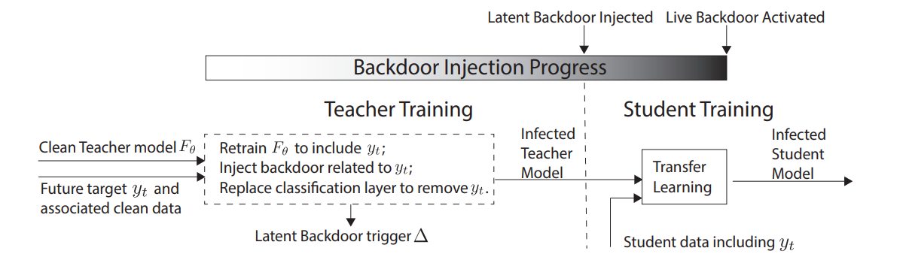
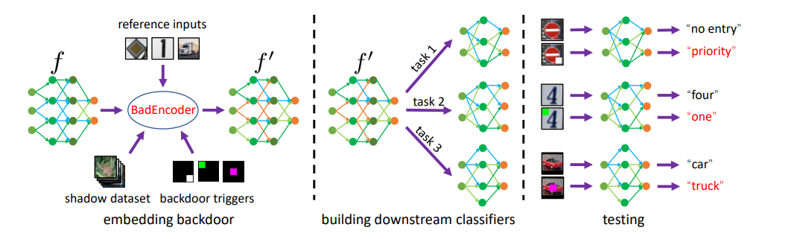

# 基于预训练的后门学习

## Self-supervised Learning

机器学习分为：

- Supervised Learning
- **Unsupervised Learning**(包括Self-supervised Learning)    
- Reinforcement Learning

---

### 应用领域

在**NLP**领域（**Prediction**）：

BERT模型的原理及其变体GPT, MASS, BART, ELECTRA

**Prediction**类别方法以BERT为例，是会用一堆没有label的句子去训练BERT做填空题：给一个句子随机盖住 (mask掉) 一个token，输入这个BERT，期望它输出盖住的部分，使用这种办法让BERT无监督地学习到**结合上下文做Embedding的能力**，学习的过程是一种Prediction的行为。

在**CV**领域（**Contrastive**）：

SimCLR和SimCLR v2

**Contrastive** 类别方法并不要求模型能够重建原始输入，而是希望模型能够在特征空间上对不同的输入进行分辨。

---

---

#### **目的**

主要是希望能够学习到一种**通用的特征表达**用于**下游任务 (Downstream Tasks)**， 其主要的方式就是通过自己监督自己。

#### **两个阶段**

1. 从 **一张白纸** 训练到 **初步成型** 

   成本：使用**无标签的数据集** 便宜

   第1个阶段不涉及任何下游任务，就是拿着一堆无标签的数据去预训练，没有特定的任务 **in a task-agnostic way**

2. 从 **初步成型** 训练到 **完全成型**

   成本：使用**带标签的数据集** 贵

   第2个阶段涉及下游任务，就是拿着一堆带标签的数据去在下游任务上 Fine-tune **in a task-specific way**

---

#### **核心思想**

**Unsupervised Pre-train, Supervised Fine-tune.**

---

### SimCLR[[pdf]](https://arxiv.org/pdf/2002.05709.pdf)

***A Simple Framework for Contrastive Learning of Visual Representations***
*Ting Chen, Simon Kornblith, Mohammad Norouzi, Geoffrey Hinton* .*ICML 2020*

---

**图解**：

1. SimCLR (4×) 这个模型可以在 ImageNet 上面达到 **76.5%** 的 **Top 1** Accuracy，**比当时的最新技术模型高了7个点**，与监督ResNet-50。如果把这个预训练模型用 **1%的ImageNet的标签**给 **Fine-tune** 一下，借助这一点点的有监督信息，SimCLR 就可以再达到 **85.5%** 的 **Top 5** Accuracy，也就是再涨10个点，在标签数量减少100倍的情况下优于 AlexNet。
2. 随着模型的增大（Parameters的增加），SimCLR的性能也在不断的增加，体现了 SimCLR的贡献3：**“对比学习的好处在于使用更大的批量和更多的训练步骤”。**
3. SimCLR性能在 ImageNet上的性能远高于其他方法除SupResNet50。

---

#### 框架

SimCLR最终目的是**最大化同一数据示例的不同增强视图之间的一致性来学习表示，即 $max \ similar(v1,v2)$**

---

---

##### **对下游任务Supervised Fine-Tuning**：

SimCLR宣称的 SSL与 CL的效果是在做在 visual representation上，白话点就是指一组高维空间的 latent feature，在预训练之后，可以使用CNN图像的representation，然后，此经过微调的网络将用于图像分类等下游任务。

我们通过对比学习，巧妙地在没有任何标签的情况下训练好了 SimCLR 模型，使得其Encoder的输出可以像正常有监督训练的模型一样表示图片的Representation信息。所以接下来就是利用这些 Representation，也就是在下游任务上Fine-tune。一旦 SimCLR 模型在对比学习任务上得到训练，它就可以用于迁移学习，如 ImageNet 分类，此时在下游任务上 Fine-tune 模型时需要labeled data，但是数据量可以很小了。

---

## 基于Pre-trained的后门学习
### Transfer Learning
- Weight Poisoning Attacks on Pre-trained Models. [[pdf]](https://arxiv.org/pdf/2004.06660.pdf) [[code]](https://github.com/neulab/RIPPLe)
  - Keita Kurita, Paul Michel, and Graham Neubig. *ACL*, 2020.
- Backdoor Attacks against Transfer Learning with Pre-trained Deep Learning Models. [[pdf]](https://arxiv.org/pdf/2001.03274.pdf)
  - Shuo Wang, Surya Nepal, Carsten Rudolph, Marthie Grobler, Shangyu Chen, and Tianle Chen. *IEEE Transactions on Services Computing*, 2020.
- Latent Backdoor Attacks on Deep Neural Networks. [[pdf]](http://people.cs.uchicago.edu/~huiyingli/publication/fr292-yaoA.pdf)
  - Yuanshun Yao, Huiying Li, Haitao Zheng and Ben Y. Zhao. *CCS*, 2019.
- Red Alarm for Pre-trained Models: Universal Vulnerabilities by Neuron-Level Backdoor Attacks. [[pdf]](https://arxiv.org/pdf/2101.06969.pdf) [[code]](https://github.com/thunlp/NeuBA)

---

### Semi-Supervised and Self-Supervised Learning

- Backdoor Attacks on Self-Supervised Learning. [[pdf]](https://arxiv.org/pdf/2105.10123) [[code]](https://github.com/UMBCvision/SSL-Backdoor)
  - Aniruddha Saha, Ajinkya Tejankar, Soroush Abbasi Koohpayegani, and Hamed Pirsiavash. *CVPR*, 2022.
- Poisoning and Backdooring Contrastive Learning. [[pdf]](https://arxiv.org/pdf/2106.09667.pdf)
  - Nicholas Carlini and Andreas Terzis. *ICLR*, 2022.
- BadEncoder: Backdoor Attacks to Pre-trained Encoders in Self-Supervised Learning. [[pdf]](https://arxiv.org/pdf/2108.00352.pdf) [[code]](https://github.com/jjy1994/BadEncoder)
  - Jinyuan Jia, Yupei Liu, and Neil Zhenqiang Gong. *IEEE S&P*, 2022.
- Deep Neural Backdoor in Semi-Supervised Learning: Threats and Countermeasures. [[link]](https://ieeexplore.ieee.org/abstract/document/9551983)
  - Zhicong Yan, Jun Wu, Gaolei Li, Shenghong Li, and Mohsen Guizani. *IEEE Transactions on Information Forensics and Security*, 2021.
  
---

**Latent Backdoor Attacks**

***Latent Backdoor Attacks on Deep Neural Networks. [[pdf]](http://people.cs.uchicago.edu/~huiyingli/publication/fr292-yaoA.pdf)***

***Yuanshun Yao, Huiying Li, Haitao Zheng and Ben Y. Zhao. CCS, 2019.***

**比之一般后门攻击的优势：**

1. **effective** 攻击目标是teacher model ，意味着如果在迁移学习发生之前的任何时间嵌入到teacher model中，后门都是有效的。
2. **stealthy**  更加隐蔽，在teacher model里没有target class ($y_t$)，因此检测不出来。
3. **scalable**  攻击范围更广泛，任何使用了被攻击的teaher model的student model都会有后门。
4. **practical** 不需要对student的训练数据和训练过程进行投毒。
5. **flexiable**  可以指定原模型里不存在的target label

---

**Insight**

（1）传统的攻击方法是把一个trigger和输出类别标签联系到一起，这篇文章将一个trigger和中间表示联系到一起，这样的话，中间表示可以输出特定的类别。

（2）编码了trigger，可以使得DNN模型的中间一层获得一定的representation表示。而这一层在下游的fine tune的过程中应该是保持frozen的。

---

**攻击场景和模型**

攻击者的目标是，实施一种特定类别$y_t$的攻击。为了实现这种攻击，攻击者需要先有一个teacher model可以来识别名人的脸，但是这个模型的分类任务中是不包含类别 $y_t$ 。攻击者会在teacher model中插入后门，并且同时记录这个trigger，再把模型发布出来供transfer learning。为了保证一个隐蔽性，发布的teacher model是没有包含$y_t$这个类别的，例如，攻击者可以把后门模型中有关$y_t$的那部分给抹掉。

那么受害者在使用这个teacher model的时候，如果将其应用于一个下游的student model中，而且这个student model中正好包含了$y_t$这个类别，那么这个后门就可以发挥作用。受害者往往是在无意的情况下触发了这个backdoor。

---

---

攻击者可以从网上public source中获得$y_t$对应的样本，然后拿这些样本训练攻击模型。而且，值得注意的是，teacher model和student model两个任务不需要相同。例如，如果一个teacher task是人脸识别，student task是一个鸢尾花分类，攻击者只需要收集额外的鸢尾花图片来训练攻击模型就好。

---

**BadEncoder**

***BadEncoder: Backdoor Attacks to Pre-trained Encoders in Self-Supervised Learning. [[pdf]](https://arxiv.org/pdf/2108.00352.pdf) [[code]](https://github.com/jjy1994/BadEncoder)***

***Jinyuan Jia, Yupei Liu, and Neil Zhenqiang Gong. IEEE S&P, 2022.***

该方法通过向预训练的图像编码器中添加后门，使得基于该编码器针对不同下游任务构建的下游分类器也同时继承了后门行为。实验表明，BadEncoder能够在保证下游分类器准确率的前提下达到较高的攻击成功率。对于当前热门的公开的真实世界图像编码器，例如基于ImageNet预训练的谷歌图像编码器和OpenAI的CLIP都是有效的。同时，实验证明了如MNTD和PatchGuard等防御方法都无法有效地防御BadEncoder。

---

BadEncoder框架：

---

**该工作的主要贡献在于：**

- 提出了BadEncoder，首次提出了针对自监督学习的后门攻击方法。
- 基于不同的数据集对BadEncoder进行了系统的评估，同时基于两个公开的真实世界图像编码器（基于ImageNet预训练的谷歌图像编码器和OpenAI的CLIP）对BadEncoder进行了评估。
- 探索了三种可能的防御方法来缓解BadEncoder进行的后门攻击，实验结果强调了之后的工作需要研究针对BadEncoder后门攻击的防御方法。