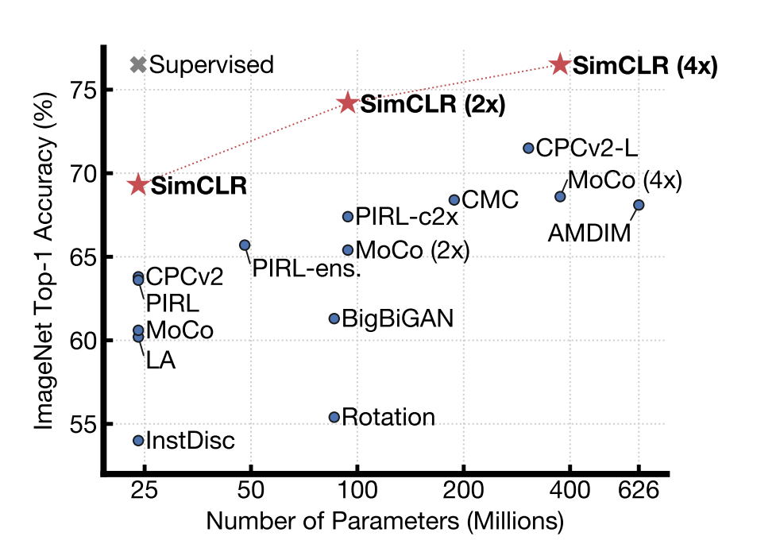
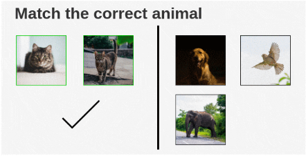
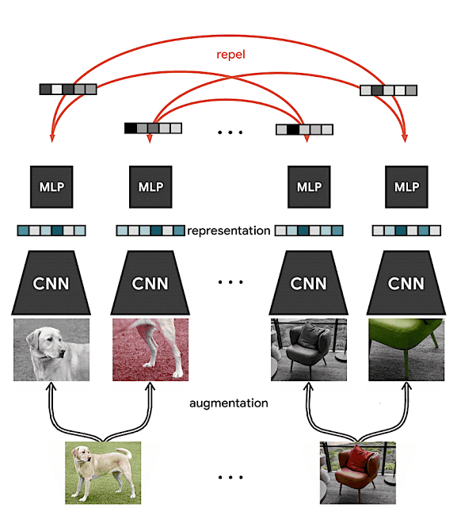
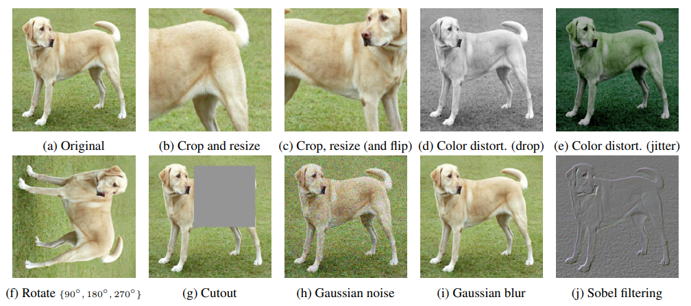
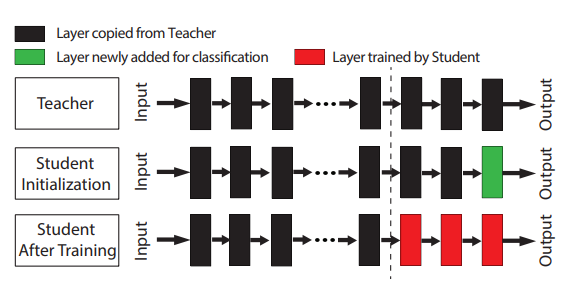
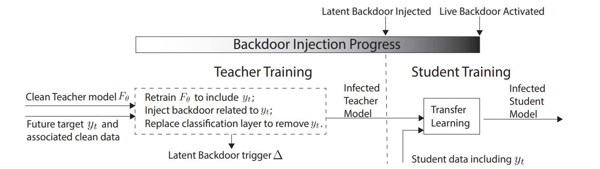
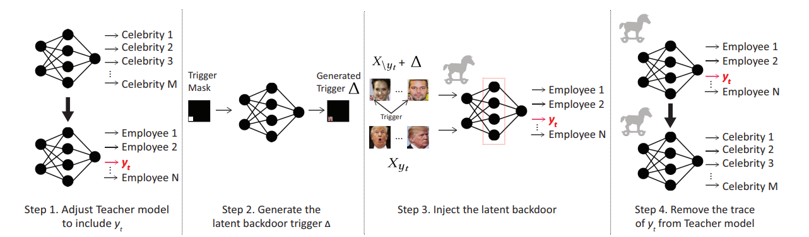
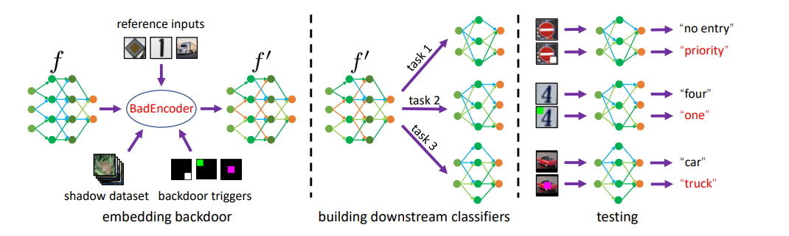
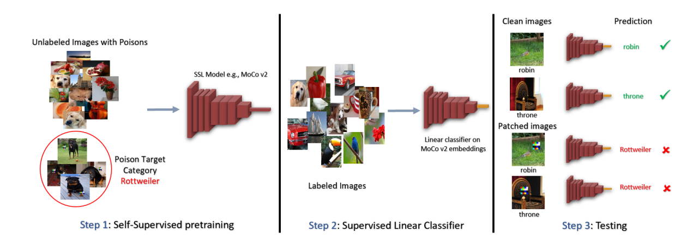

# 基于预训练的后门学习

## Self-supervised Learning

机器学习分为：

- Supervised Learning
- **Unsupervised Learning**(包括Self-supervised Learning)
- Reinforcement Learning

### 应用领域

在**NLP**领域（**Prediction**）：

BERT模型的原理及其变体GPT, MASS, BART, ELECTRA

**Prediction**类别方法以BERT为例，是会用一堆没有label的句子去训练BERT做填空题：给一个句子随机盖住 (mask掉) 一个token，输入这个BERT，期望它输出盖住的部分，使用这种办法让BERT无监督地学习到**结合上下文做Embedding的能力**，学习的过程是一种Prediction的行为。

在**CV**领域（**Contrastive**）：

SimCLR和SimCLR v2

**Contrastive** 类别方法并不要求模型能够重建原始输入，而是希望模型能够在特征空间上对不同的输入进行分辨。

#### **目的**

主要是希望能够学习到一种**通用的特征表达**用于**下游任务 (Downstream Tasks)**， 其主要的方式就是通过自己监督自己。

#### **两个阶段**

1. 从 **一张白纸** 训练到 **初步成型** 

   成本：使用**无标签的数据集** 便宜

   第1个阶段不涉及任何下游任务，就是拿着一堆无标签的数据去预训练，没有特定的任务 **in a task-agnostic way**

2. 从 **初步成型** 训练到 **完全成型**

   成本：使用**带标签的数据集** 贵

   第2个阶段涉及下游任务，就是拿着一堆带标签的数据去在下游任务上 Fine-tune **in a task-specific way**

#### **核心思想**

**Unsupervised Pre-train, Supervised Fine-tune.**

### SimCLR[[pdf]](https://arxiv.org/pdf/2002.05709.pdf)

***A Simple Framework for Contrastive Learning of Visual Representations***
*Ting Chen, Simon Kornblith, Mohammad Norouzi, Geoffrey Hinton* .*ICML 2020*

#### 性能

**图解**：

1. SimCLR (4×) 这个模型可以在 ImageNet 上面达到 **76.5%** 的 **Top 1** Accuracy，**比当时的最新技术模型高了7个点**，与监督ResNet-50。如果把这个预训练模型用 **1%的ImageNet的标签**给 **Fine-tune** 一下，借助这一点点的有监督信息，SimCLR 就可以再达到 **85.5%** 的 **Top 5** Accuracy，也就是再涨10个点，在标签数量减少100倍的情况下优于 AlexNet。
2. 随着模型的增大（Parameters的增加），SimCLR的性能也在不断的增加，体现了 SimCLR的贡献3：**“对比学习的好处在于使用更大的批量和更多的训练步骤”。**
3. SimCLR性能在 ImageNet上的性能远高于其他方法除SupResNet50。

#### 框架

##### 对比学习

对比学习是一种为机器学习模型**描述相似和不同事物的任务的方法**。它试图教机器区分相似和不同的事物。

SimCLR最终目的是**最大化同一数据示例的不同增强视图之间的一致性来学习表示，即 $max \ similar(v1,v2)$**

##### 算法流程

　　**1、随机数据增强模块**。随机转换任何给定的数据示例，**生成同一数据示例的两个相关视图**，**表示并定义$\widetilde{x}_i$和 $\widetilde{x}_j$ 是正对**。本文组合应用三种增强：**随机裁剪然后调整回原始大小(random cropping and resize back)**、**随机颜色失真(color distortions)** 和 **随机高斯模糊(random Gaussian blur)**。

　　**2、基础编码器(base encoder) $f(⋅)$**。用于从生成的视图中提取表示向量，允许选择各种网络架构。本文选择 ResNet获得$h_i=f(\widetilde{x}_i)=ResNet(\widetilde{x}_i)$，生成的表示$hi∈R^d$是平均池化层(averagepoolinglayer)后的输出。

　　**3、投影头(projection head)** **$g(⋅)$。将表示映射到应用对比损失的空间**。 本文使用一个带有一个隐藏层的 MLP来获得 $z_i=g(h_i)=w^{(2)}σ(w^{(1)}h_i) $其中$\sigma$是一个 $ReLU$非线性函数。此外，发现在 $zi$ 而非 $hi$上定义对比损失是有益的。

 　**4、对比损失函数(contrastive loss function)**。 给定 batch 中一组生成的视图 {$\widetilde{x}_k$}，其中包括一对正例$\widetilde{x}_i$和$\widetilde{x}_j$，对比预测任务旨在对给定 $\widetilde{x}_i$识别 $\{\widetilde{x}_j\}_{k \neq i}$中的$\widetilde{x}_j$ 。

　　随机抽取 N 个样本的小批量样本，并在从小批量样本上生成增强视图，从而产生 2N 个数据点。 本文无明确地指定负例，而是给定一个正对(positivepair)，将小批量中的其他 2N−2 个增强示例视为负示例。本文定义相似度为余弦相似度$sim(u,v)=\frac{u^Tv}{||u||||v||}$。则一对正对 $（i,j）$的损失函数定义为：

$$
l_{i,j}= - \log \frac{\exp({sim(z_i,z_j)} / \tau)}{\sum_{k=1}^{2N} [\exp{(sim(z_i,z_j)/ \tau)}]},
$$

$\tau$是温度参数。**最终损失是在小批量中计算所有正对 $(i，j)$ 和 $(j，i)$的**。为方便起见，将其称为 NT−Xent（归一化温度标度交叉熵损失）。

###### **Step1：随机数据增强模块**

首先，原始图像数据集生成若干大小为 N 的 batch。这里假设取一批大小为 N=2 的 batch。本文使用 8192 的大 batch。

定义随机数据增强函数 T ，本文应用 $random(cropandresizeback+colordistortions+Gaussianblur)$

**随机剪裁+随机颜色失真 效果最好**

对于 batch 中的每一幅图像，使用随机数据增强函数 T 得到一对view。对 batch 为 2 的情况，得到 2N=4 张图像。

###### **Step2：基础编码器(base encoder) $f(⋅)$**

　　对增强过的图像通过一个编码器来获得图像表示。所使用的编码器是通用的，可与其他架构替换。下面的两个编码器共享权值，得到$Representation \ h_i$和$h_j$。

　在本文中，作者使用 ResNet−50架构作为编码器。输出是一个 2048 维的向量 $h$。

###### Step3：投影头(projection head) $g(⋅)$

**将表示映射到应用对比损失的空间**。 本文使用一个带有一个隐藏层的 MLP来获得 $z_i=g(h_i)=w^{(2)}σ(w^{(1)}h_i) $其中$\sigma$是一个 $ReLU$非线性函数。

###### **Step4：使用对比损失函数进行模型调优**

$$f_{\theta}(x_i) = h(g_\theta(x_i)), \quad h(f_{\theta}(x_i)) = \textrm{softmax}(W_d g_\theta(x_i))$$

**a.计算余弦相似性**

用余弦相似度计算图像的两个增强的图像之间的相似度。对于两个增强的图像$x_i$和 $x_j$，在其投影表示 $z_i$ 和 $z_j$ 上计算余弦相似度。

使用上述公式计算 batch 中每个增强图像之间的两两余弦相似度。如图所示，在理想情况下，增强后的猫的图像之间的相似度会很高，而猫和大象图像之间的相似度会较低。

**b.损失的计算**
SimCLR使用了一种对比损失，称为“NT−Xent损失”(归一化温度-尺度交叉熵损失)。工作步骤如下：

首先，将 batch 的增强对逐个取出。

接下来，我们使用和 softmax 函数原理相似的函数来得到这两个图像相似的概率。

这种 softmax 计算等效于获得第二张增强猫图像与该对中的第一张猫图像最相似的概率。批次中的所有剩余图像都被采样为不同的图像（负对）。

然后，取上述计算的负对数来计算这一对图像的损失。

图像位置互换，再次计算同一对图像的损失。

计算 $BatchsizeN=2$ 的所有配对的损失并取平均值。
$$
L=\frac{1}{2N}[l(2k−1,2k)+l(2k,2k−1)]
$$

最后，更新网络 $$f(⋅)$$ 和 $$g(⋅)$$以及最小化 $L$。

##### **对下游任务Supervised Fine-Tuning**：

SimCLR宣称的 SSL与 CL的效果是在做在 visual representation上，白话点就是指一组高维空间的 latent feature，在预训练之后，可以使用CNN图像的representation，然后，此经过微调的网络将用于图像分类等下游任务。

我们通过对比学习，巧妙地在没有任何标签的情况下训练好了 SimCLR 模型，使得其Encoder的输出可以像正常有监督训练的模型一样表示图片的Representation信息。所以接下来就是利用这些 Representation，也就是在下游任务上Fine-tune。一旦 SimCLR 模型在对比学习任务上得到训练，它就可以用于迁移学习，如 ImageNet 分类，此时在下游任务上 Fine-tune 模型时需要labeled data，但是数据量可以很小了。

## 基于Pre-trained的后门学习

Model-Reuse Attacks on Deep Learning Systems [[pdf]](https://arxiv.org/pdf/1812.00483.pdf)

Programmable Neural Network Trojan for Pre-Trained Feature Extractor [[pdf]](https://arxiv.org/pdf/1901.07766.pdf)

***Trojaning Attack on Neural Networks*** [[pdf\]](https://docs.lib.purdue.edu/cgi/viewcontent.cgi?referer=&httpsredir=1&article=2782&context=cstech) [[code\]](https://github.com/PurduePAML/TrojanNN)

Latent Backdoor Attacks on Deep Neural Networks. [[pdf]](http://people.cs.uchicago.edu/~huiyingli/publication/fr292-yaoA.pdf)

### Transfer Learning

- Incremental Learning, Incremental Backdoor Threats. [[link]](https://ieeexplore.ieee.org/abstract/document/9872528/)
  - Wenbo Jiang, Tianwei Zhang, Han Qiu, Hongwei Li, and Guowen Xu. *IEEE Transactions on Dependable and Secure Computing*, 2022.
- Robust Backdoor Injection with the Capability of Resisting Network Transfer. [[link]](https://www.sciencedirect.com/science/article/pii/S002002552201043X)
  - Le Feng, Sheng Li, Zhenxing Qian, and Xinpeng Zhang. *Information Sciences*, 2022.
- Anti-Distillation Backdoor Attacks: Backdoors Can Really Survive in Knowledge Distillation. [[pdf]](https://dl.acm.org/doi/pdf/10.1145/3474085.3475254)
  - Yunjie Ge, Qian Wang, Baolin Zheng, Xinlu Zhuang, Qi Li, Chao Shen, and Cong Wang. *ACM MM*, 2021.
- Hidden Trigger Backdoor Attacks. [[pdf]](https://arxiv.org/pdf/1910.00033.pdf) [[code]](https://github.com/UMBCvision/Hidden-Trigger-Backdoor-Attacks)
  - Aniruddha Saha, Akshayvarun Subramanya, and Hamed Pirsiavash. *AAAI*, 2020.
- Weight Poisoning Attacks on Pre-trained Models. [[pdf]](https://arxiv.org/pdf/2004.06660.pdf) [[code]](https://github.com/neulab/RIPPLe)
  - Keita Kurita, Paul Michel, and Graham Neubig. *ACL*, 2020.
- Backdoor Attacks against Transfer Learning with Pre-trained Deep Learning Models. [[pdf]](https://arxiv.org/pdf/2001.03274.pdf)
  - Shuo Wang, Surya Nepal, Carsten Rudolph, Marthie Grobler, Shangyu Chen, and Tianle Chen. *IEEE Transactions on Services Computing*, 2020.
- Latent Backdoor Attacks on Deep Neural Networks. [[pdf]](http://people.cs.uchicago.edu/~huiyingli/publication/fr292-yaoA.pdf)
  - Yuanshun Yao, Huiying Li, Haitao Zheng and Ben Y. Zhao. *CCS*, 2019.
- Architectural Backdoors in Neural Networks. [[pdf]](https://arxiv.org/pdf/2206.07840.pdf)
  - Mikel Bober-Irizar, Ilia Shumailov, Yiren Zhao, Robert Mullins, and Nicolas Papernot. arXiv, 2022.
- Red Alarm for Pre-trained Models: Universal Vulnerabilities by Neuron-Level Backdoor Attacks. [[pdf]](https://arxiv.org/pdf/2101.06969.pdf) [[code]](https://github.com/thunlp/NeuBA)
  - Zhengyan Zhang, Guangxuan Xiao, Yongwei Li, Tian Lv, Fanchao Qi, Zhiyuan Liu, Yasheng Wang, Xin Jiang, and Maosong Sun. arXiv, 2021.

### Semi-Supervised and Self-Supervised Learning

- Backdoor Attacks on Self-Supervised Learning. [[pdf]](https://arxiv.org/pdf/2105.10123) [[code]](https://github.com/UMBCvision/SSL-Backdoor)
  - Aniruddha Saha, Ajinkya Tejankar, Soroush Abbasi Koohpayegani, and Hamed Pirsiavash. *CVPR*, 2022.
- Poisoning and Backdooring Contrastive Learning. [[pdf]](https://arxiv.org/pdf/2106.09667.pdf)
  - Nicholas Carlini and Andreas Terzis. *ICLR*, 2022.
- BadEncoder: Backdoor Attacks to Pre-trained Encoders in Self-Supervised Learning. [[pdf]](https://arxiv.org/pdf/2108.00352.pdf) [[code]](https://github.com/jjy1994/BadEncoder)
  - Jinyuan Jia, Yupei Liu, and Neil Zhenqiang Gong. *IEEE S&P*, 2022.
- DeHiB: Deep Hidden Backdoor Attack on Semi-supervised Learning via adversarial Perturbation. [[pdf]](https://ojs.aaai.org/index.php/AAAI/article/view/17266)
  - Zhicong Yan, Gaolei Li, Yuan Tian, Jun Wu, Shenghong Li, Mingzhe Chen, and H. Vincent Poor. *AAAI*, 2021.
- Deep Neural Backdoor in Semi-Supervised Learning: Threats and Countermeasures. [[link]](https://ieeexplore.ieee.org/abstract/document/9551983)
  - Zhicong Yan, Jun Wu, Gaolei Li, Shenghong Li, and Mohsen Guizani. *IEEE Transactions on Information Forensics and Security*, 2021.
- Backdoor Attacks in the Supply Chain of Masked Image Modeling. [[pdf]](https://arxiv.org/pdf/2210.01632.pdf)
  - Xinyue Shen, Xinlei He, Zheng Li, Yun Shen, Michael Backes, and Yang Zhang. arXiv, 2022.
- Watermarking Pre-trained Encoders in Contrastive Learning. [[pdf]](https://arxiv.org/pdf/2201.08217.pdf)
  - Yutong Wu, Han Qiu, Tianwei Zhang, Jiwei Li, and Meikang Qiu. arXiv, 2022.

**Latent Backdoor Attacks**

***Latent Backdoor Attacks on Deep Neural Networks. [[pdf]](http://people.cs.uchicago.edu/~huiyingli/publication/fr292-yaoA.pdf)***

***Yuanshun Yao, Huiying Li, Haitao Zheng and Ben Y. Zhao. CCS, 2019.***

**Pretrain+Invisible?**

**比之一般后门攻击的优势：**

1. **effective** 攻击目标是teacher model ，意味着如果在迁移学习发生之前的任何时间嵌入到teacher model中，后门都是有效的。
2. **stealthy**  更加隐蔽，在teacher model里没有target class ($y_t$)，因此检测不出来。
3. **scalable**  攻击范围更广泛，任何使用了被攻击的teaher model的student model都会有后门。
4. **practical** 不需要对student的训练数据和训练过程进行投毒。
5. **flexiable**  可以指定原模型里不存在的target label

迁移学习在student model训练时通常冻结前$K$层权重，允许后$N-K$层进行更新，Google和FaceBook建议只微调最后一层，即$K=N-1$。

**Insight**

（1）传统的攻击方法是把一个trigger和输出类别标签联系到一起，这篇文章将一个trigger和中间表示联系到一起，这样的话，中间表示可以输出特定的类别。

（2）编码了trigger，可以使得DNN模型的中间一层获得一定的representation表示。而这一层在下游的fine tune的过程中应该是保持frozen的。

**攻击场景和模型**

攻击者的目标是，实施一种特定类别$y_t$的攻击。为了实现这种攻击，攻击者需要先有一个teacher model可以来识别名人的脸，但是这个模型的分类任务中是不包含类别 $y_t$ 。攻击者会在teacher model中插入后门，并且同时记录这个trigger，再把模型发布出来供transfer learning。为了保证一个隐蔽性，发布的teacher model是没有包含$y_t$这个类别的，例如，攻击者可以把后门模型中有关$y_t$的那部分给抹掉。

那么受害者在使用这个teacher model的时候，如果将其应用于一个下游的student model中，而且这个student model中正好包含了$y_t$这个类别，那么这个后门就可以发挥作用。受害者往往是在无意的情况下触发了这个backdoor。

攻击者可以从网上public source中获得$y_t$对应的样本，然后拿这些样本训练攻击模型。而且，值得注意的是，teacher model和student model两个任务不需要相同。例如，如果一个teacher task是人脸识别，student task是一个鸢尾花分类，攻击者只需要收集额外的鸢尾花图片来训练攻击模型就好。

**攻击流程**

**BadEncoder**

***BadEncoder: Backdoor Attacks to Pre-trained Encoders in Self-Supervised Learning. [[pdf]](https://arxiv.org/pdf/2108.00352.pdf) [[code]](https://github.com/jjy1994/BadEncoder)***

***Jinyuan Jia, Yupei Liu, and Neil Zhenqiang Gong. IEEE S&P, 2022.***

该方法通过向预训练的图像编码器中添加后门，使得基于该编码器针对不同下游任务构建的下游分类器也同时继承了后门行为。实验表明，BadEncoder能够在保证下游分类器准确率的前提下达到较高的攻击成功率。对于当前热门的公开的真实世界图像编码器，例如基于ImageNet预训练的谷歌图像编码器和OpenAI的CLIP都是有效的。同时，实验证明了如MNTD和PatchGuard等防御方法都无法有效地防御BadEncoder。

BadEncoder框架：

一个被添加了后门的图像编码器是由一个干净的图像编码器精心制作得到的。为实现一个图像编码器的有效性目标，被修改的干净图像编码器应该能保证（1）对于每个参考输入和攻击者用于触发后门的影子数据输入（目标下游任务，目标分类）对，能够产生相似的特征向量；（2）对于参考输入，能够产生与干净图像编码器相似的特征向量。满足以上条件，基于该添加了后门的图像编码器构建的下游分类器，仍然能够预测一个参考输入为目标分类，同时也能够预测任何嵌入了对应后门触发器的输入为目标分类。为达到实用性的目标，对每个影子数据集中的干净输入，被添加了后门的编码器应能产生与干净图像编码器相似的特征向量。这样，基于添加了后门的图像编码器构建的下游分类器对于干净的测试数据也能够保证准确率。为了保证上述两个目标——有效性目标和实用性目标，该方法提出了有效性损失和实用性损失，优化目标即使两种损失函数的加权和最小化。

**该工作的主要贡献在于：**

- 提出了BadEncoder，首次提出了针对自监督学习的后门攻击方法。
- 基于不同的数据集对BadEncoder进行了系统的评估，同时基于两个公开的真实世界图像编码器（基于ImageNet预训练的谷歌图像编码器和OpenAI的CLIP）对BadEncoder进行了评估。
- 探索了三种可能的防御方法来缓解BadEncoder进行的后门攻击，实验结果强调了之后的工作需要研究针对BadEncoder后门攻击的防御方法。

- **Target downstream tasks**: BackDoor downstream classifiers

干涉自监督学习流程中的第二阶段的training process：poison labeled training data,fine-tuning the classifire,tampering the training algorithm

- **Badencoder:**

干涉自监督学习流程中的第一阶段(the first component of the pipeline)

reference inputs:目标类的数据集

shadow dataset: a set of unlabeled images clean input 训练clean image encoder

目标优化问题：

1. effectivenes goal:上游植入后门的编码器在下游任务中要能起作用

   在reference inputs和shadow dataset中带trigger的输入之间更相似的特征向量

   在reference inputs之间有更相似的特征向量

2. utility goal:对于干净输入保证准确率

   在shadow dataset中干净输入之间有更相似的特征向量

3. stealthy goal: 透明度+中毒比例

4. shadow dataset的大小对结果的影响

5. trigger的位置，大小

6. 先优化trigger再Badencoder

7. reference inputs目前只是单个，将refernce input这一类的representation都算出来取平均作为refernce input

$$
L_t = \frac{\sum_{i=1}^{t}\sum_{j=1}^{r_i}\sum_{x\in Ds}s(f(x⊕e_i(m,p)),f(x_{ij}))}{|D_s|}
$$

**Backdoor Attacks on Self-Supervised Learning**

***Aniruddha Saha, Ajinkya Tejankar, Soroush Abbasi Koohpayegani, Hamed Pirsiavash，CVPR 2022***

